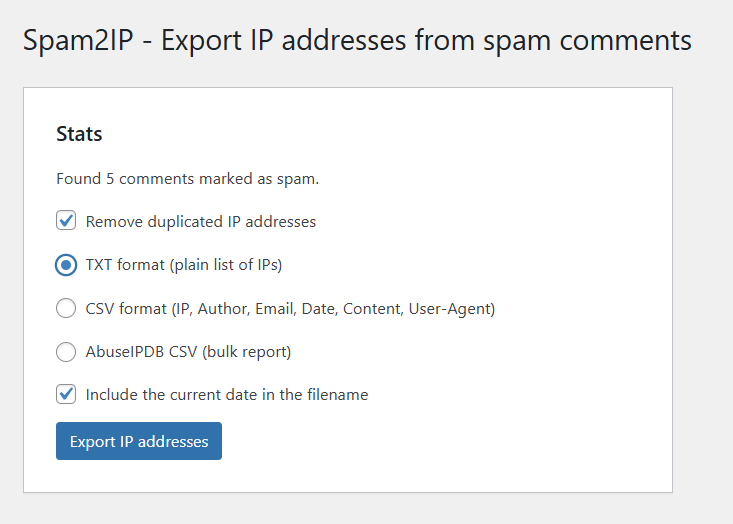

# WP-Spam2IP

[](https://wordpress.org/)
[](https://php.net/)
[](https://choosealicense.com/licenses/mit/)

## 📝 Description

WP-Spam2IP is a lightweight WordPress plugin that allows you to export IP addresses from comments marked as spam. The
plugin enables export in TXT format (simple list of IP addresses) and CSV format (with additional information such as
author, email, date, content, and User-Agent).



## ✨ Features

- 📋 Export IP addresses from spam comments
- 🔄 Remove duplicate IP addresses
- 📊 Export in TXT and CSV formats
- 📅 Add date to filename
- 📱 WordPress dashboard widget showing spam count
- 🤖 Generate ready to use AbuseIPDB bulk report CSV file

## 🔧 Requirements

- WordPress 6.7.1 or newer
- PHP 8.2 or newer

## 📥 Installation

1. Download the ZIP file with the latest version of the plugin
   from [GitHub repository](https://github.com/MrBoombastic/wp-spam2ip/releases)
2. Go to the WordPress admin panel > Plugins > Add New > Upload Plugin
3. Select the downloaded ZIP file and click "Install Now"
4. Activate the plugin

## 📋 Usage

1. Go to Comments > Spam2IP in the WordPress admin panel
2. Select export options:
    - Remove duplicate IP addresses
    - Export format (TXT or CSV)
    - Add date to filename
3. Click "Export IP addresses"
4. The file will be automatically downloaded

## 📊 Available Export Formats

### TXT Format

Simple list of IP addresses, one per line:

```
192.168.1.1
10.0.0.1
172.16.0.1
```

### CSV Format

Extended format containing additional information:

```
IP,Author,Email,Date,Content,User-Agent
"192.168.1.1","John Doe","john@example.com","2025-09-17 12:34:56","This is spam content","Mozilla/5.0..."
"10.0.0.1","Jane Smith","jane@example.com","2025-09-17 13:45:12","Another spam message","Chrome/100.0..."
```

## 🔍 Dashboard Widget

The plugin adds a widget to the WordPress dashboard that displays the number of comments marked as spam and offers quick
access to the export functionality.


